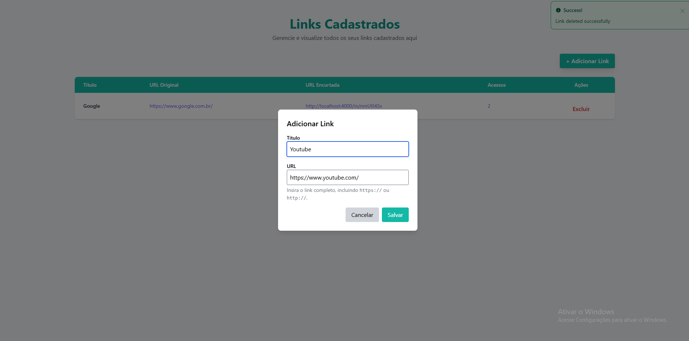
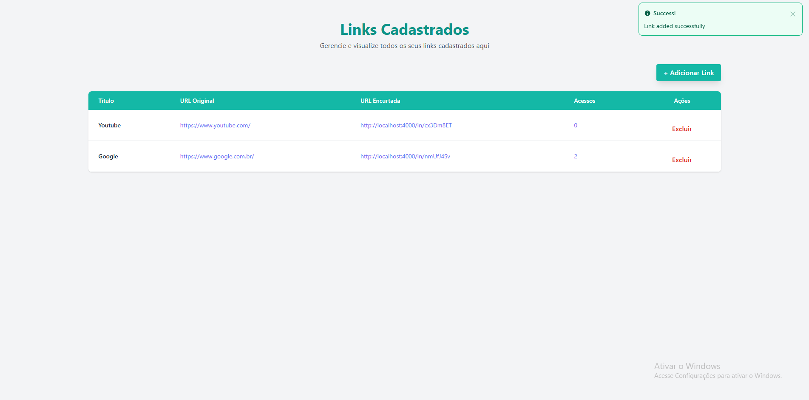

# Linkly

Linkly é um encurtador de links desenvolvido com Elixir e Phoenix, utilizando PostgreSQL como banco de dados, e com estilização feita em Tailwind CSS. O projeto permite que os usuários cadastrem links, visualizem os links registrados e acompanhem o número de cliques em cada link. Além disso, conta com um fluxo de cadastro/login de usuários, bem como funcionalidades de cadastro e remoção de links.

<p align="center">
  
  
</p>
<p align="center">
  
  
</p>

## Funcionalidades

- **Encurtamento de Links:** Os usuários podem cadastrar links e obter uma versão encurtada.
- **Visualização de Links:** A página principal exibe os links cadastrados, juntamente com o número de vezes que cada link foi clicado.
- **Cadastro/Login de Usuários:** Os usuários podem criar contas, realizar login e interagir com seus links.
- **Cadastro/Remoção de Links:** Após o login, os usuários podem adicionar e remover links encurtados.

## Tecnologias

- **Backend:** Elixir com Phoenix
- **Banco de Dados:** PostgreSQL
- **Estilização:** Tailwind CSS
- **Containerização:** Docker

## Como Rodar o Projeto

### Pré-requisitos

- **Docker** instalado na sua máquina.
- **Docker Compose** instalado na sua máquina.
- **Elixir**: Instale o Elixir seguindo as instruções da [documentação oficial](https://elixir-lang.org/install.html).
- **Erlang**: O Elixir depende do Erlang. A instalação do Elixir já inclui o Erlang.
- **Phoenix**: Instale o Phoenix executando o comando:

 ```bash
  mix archive.install hex phx_new
```

### Passos para Rodar o Projeto

## Instalação e Configuração

1. Clone o repositório:

```bash
git clone https://github.com/joao-carlos-pereira-alves/linkly
cd linkly
```

2. Instale as dependências:

```bash
mix deps.get
```

3. Configure o Docker para subir o PostgreSQL:

```bash
docker-compose -f docker-compose.dev.yml up --build
```

4. Crie o banco de dados e rode as migrações:

```bash
mix ecto.setup
```

5. Inicie o servidor Phoenix:

```bash
mix phx.server
```

A API estará disponível em `http://localhost:4000`.

## Testes

Execute os testes com o seguinte comando:

```bash
mix test
```
